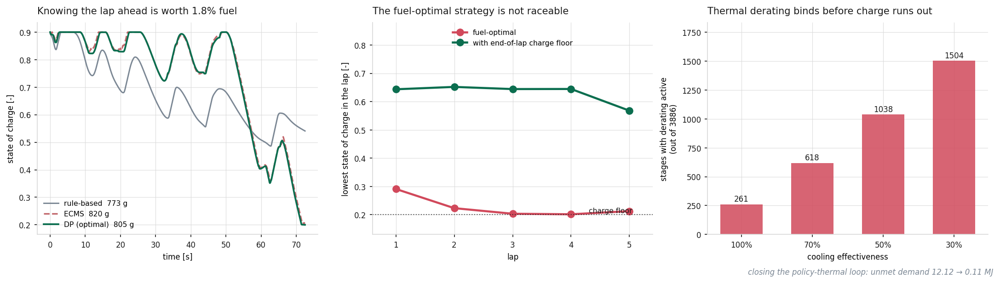

# Thermal-Aware Energy Management for a Hybrid Race Powertrain

**How should a hybrid race car split power between its combustion engine and its
electric motor, lap after lap, when the battery is small and gets hot?** This
project answers that question on real Formula 1 telemetry, under the 2026
technical regulations, by building a physics-based model of the power unit and
comparing control strategies of increasing sophistication — from a simple
heuristic to optimal control with full knowledge of the lap ahead.



[](https://github.com/tommasoandina1/Thermal-Aware-Energy-Management-System-for-a-Hybrid-Motorsport-Powertrain/actions/workflows/tests.yml)

[](LICENSE)

## Key results

- **The fuel-optimal strategy is not raceable.** Over five laps it drains the
  battery to its floor at every lap boundary, leaving no reserve. Adding a
  one-sided penalty on end-of-lap charge **halves the power demand the car
  cannot meet** (1.79 → 0.90 MJ) for 3.5% more fuel — and the simple fixed
  floor beats the lap-dependent schedule on both axes, contradicting the design
  intent behind the latter.
- **Knowing the future is worth 1.8% fuel.** On a single qualifying lap, ECMS
  (instantaneous) costs 820.09 g against 805.48 g for dynamic programming with
  full knowledge of the velocity profile, at the same final charge and the same
  deployed energy.
- **Thermal derating binds earlier than expected.** The working hypothesis was
  that charge runs out before the pack gets hot. It does not: derating is
  already active for 261 of 3886 stages at nominal cooling, rising to 1504 at
  30% cooling effectiveness. The 2026 pack is small enough that the C-rate
  needed to deploy 350 kW heats it past its threshold before the charge floor
  is reached.
- **Closing the loop recovers feasibility.** Under degraded cooling, iterating
  between the optimal policy and the thermal model until they agree (11
  iterations, 10.37 → 0.29 °C residual) takes unmet demand from 12.12 MJ to
  0.11 MJ for 2.9% more fuel — without promoting temperature to a third state
  variable.

Every number above is reproduced, with the reasoning behind it, in
[`controller/Summary_of_Results.ipynb`](controller/Summary_of_Results.ipynb).

## Stack

`Python` · `NumPy` · `SciPy` · `Matplotlib` · `Jupyter` · `pytest` ·
[`FastF1`](https://github.com/theOehrly/Fast-F1) telemetry

**Methods:** dynamic programming (backward value iteration on a discretized
state grid, vectorized) · ECMS (equivalent consumption minimization) ·
quasistatic powertrain modeling · equivalent-circuit battery with
lumped-capacitance thermal model · fixed-point iteration for policy–plant
self-consistency · signal reconstruction from noisy telemetry (spline
differentiation).

## Quickstart

```bash
git clone https://github.com/tommasoandina1/Thermal-Aware-Energy-Management-System-for-a-Hybrid-Motorsport-Powertrain
cd Thermal-Aware-Energy-Management-System-for-a-Hybrid-Motorsport-Powertrain
pip install -r requirements.txt

pytest -q                                  # physical sanity checks on the plant

python scripts/build_velocity_profile.py   # telemetry -> velocity/acceleration
python scripts/simulation.py               # -> gearbox power demand
```

Then open [`controller/Summary_of_Results.ipynb`](controller/Summary_of_Results.ipynb)
for the results, or [`controller/README.md`](controller/README.md) for the
notebook-by-notebook reading order, the execution order the saved results
depend on, and the known limitations of each strategy.

The first telemetry download populates a local FastF1 cache under
`scripts/f1_cache/` (~230 MB, not committed).

## What is being modeled

A 2026-regulation hybrid power unit: a 1.6 L V6 turbo internal combustion
engine capped at 400 kW, an MGU-K electrical machine limited to ±350 kW with a
9 MJ per-lap deploy allowance, and a 5.7 MJ energy store. At every instant the
controller decides how much of the driver's power request each one delivers.
The car follows a fixed velocity profile taken from a real qualifying lap, so
lap time is fixed and the question is purely about energy.

- **Vehicle dynamics** — longitudinal force balance (drag, rolling resistance,
  inertia) converted to power demand at the gearbox. Acceleration is
  reconstructed from raw telemetry with a quartic spline on the irregular time
  grid, which keeps the resulting power peaks inside the physical ceiling.
- **ICE** — affine Willans line (`P_e = eta_ICE * P_fuel - P_ICE0`) with the
  regulatory fuel-flow limit, calibrated so the achievable power matches the
  400 kW cap.
- **MGU-K** — instantaneous power limits, cumulative per-lap deploy budget
  reset at each lap boundary, and a temperature-dependent derating factor on
  maximum discharge.
- **Battery** — equivalent circuit (open-circuit voltage in series with
  internal resistance), solved in closed form for terminal voltage, with
  Coulomb counting for charge integration. The OCV curve is calibrated from a
  published high-power Li-ion cell (Samsung INR21700-48X, Rukavina et al. 2023)
  and rescaled to the pack voltage window, since real pack data is proprietary.
- **Thermal** — lumped-capacitance pack temperature driven by Joule heating and
  convective cooling to a fixed-inlet coolant, with linear derating above a
  threshold.
- **Shortfall accounting** — the plant never silently compensates a saturated
  component with another. Any gap between requested and deliverable power is
  reported, for the controller to handle. This is what makes the fuel numbers
  comparable at all.

## Control strategies

| Strategy | Knowledge of the future | Status |
|---|---|---|
| Rule-based (SoC-scheduled) | None | Implemented |
| ECMS | None (DP-referenced equivalence factor) | Implemented |
| DP, single lap | Full (benchmark / upper bound) | Implemented |
| DP, multi-lap + charge repeatability constraint | Full | Implemented |
| DP + thermal derating, self-consistent | Full, thermally aware | Implemented |
| Reinforcement learning (SAC) | Learned, causal | Future work |

## Project structure

```
.
├── controller/          # the five notebooks + rule-based baseline (see its README)
├── plant/               # parameters, vehicle dynamics, battery, powertrain
├── scripts/             # telemetry -> velocity profile -> power demand -> figures
├── tests/               # pytest sanity checks on the plant model
├── data/                # inputs and exported results (.npy / .npz)
├── img/                 # exported figures
├── paths.py             # single source of truth for every path
└── Compare_Controllers.ipynb
```

## Scope and honest limitations

Active portfolio project developed alongside a master's thesis in Mechatronics
Engineering at Politecnico di Torino. Deliberate simplifications, stated rather
than hidden:

- No turbocharger sub-model and no engine-speed dependence (the Willans-line
  simplification validated in Ebbesen et al.).
- No hydraulic-brake dissipation model; unrecovered braking is reported as
  shortfall.
- MGU-K power is controlled in electrical terms in the DP/ECMS formulations
  (`eta_MGU = 1` in the power balance) while the forward pass uses the real
  plant, so the resulting mismatch is measured rather than assumed away.
- Thermal derating is enforced as a bound made self-consistent by fixed-point
  iteration, not by promoting temperature to a third DP state — a deliberate
  cost/accuracy tradeoff, discussed in
  [`controller/04_multi_lap_DP_thermal.ipynb`](controller/04_multi_lap_DP_thermal.ipynb).
- Internal resistance is constant (not temperature-dependent); OCV and thermal
  parameters come from published reference data, not from a calibrated pack.
- The ECMS equivalence factor tracks the DP charge trajectory, so ECMS here is
  an upper bound on achievable performance, not a causal controller.

## References

- Guzzella, L., Sciarretta, A. *Vehicle Propulsion Systems*, 3rd ed., Springer, 2013.
- Ebbesen, S., Salazar, M., Elbert, P., Bussi, C., Onder, C.H. "Time-Optimal
  Control Strategies for a Hybrid Electric Race Car." *IEEE Transactions on
  Control Systems Technology*, 26(1), 2018.
- Rukavina, F., Leko, D., Matijašić, M., Bralić, I., Ugalde, J.M., Vašak, M.
  "Identification of equivalent circuit model parameters for a Li-ion battery
  cell." *Proc. 2023 IEEE 11th International Conference on Systems and Control.*

## License

MIT — see [LICENSE](LICENSE).
